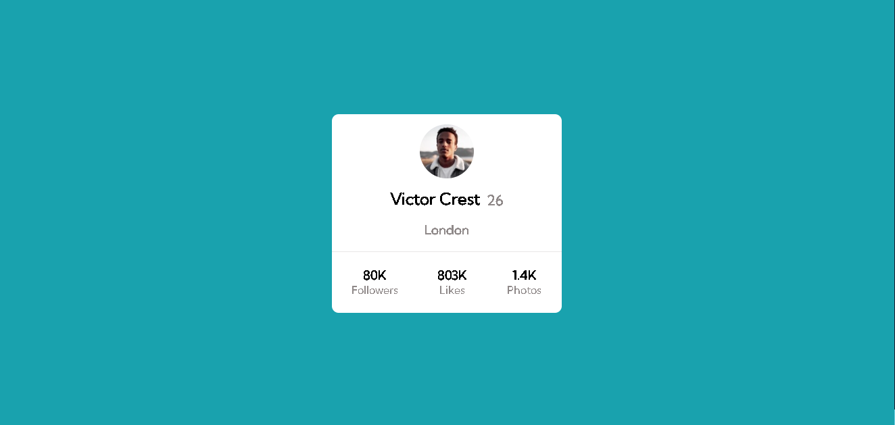
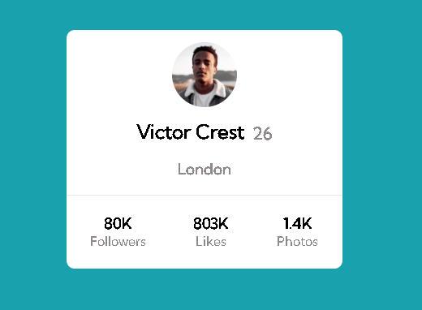
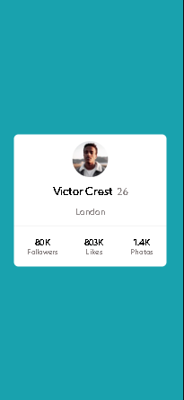

# Cartão de Perfil
Projeto de estudo: um layout de perfil estilo Instagram. Consegui aplicar os conceitos que aprendi recentemente de especificações e utilizar tags mais semânticas em situações específicas. Além disso, não precisei criar um arquivo responsivo, pois consegui tornar o projeto responsivo apenas desenvolvendo a versão desktop.😊🤳

## Versão Desktop:

[]

[]

## Versão Celular:

[]

## Tecnologias utilizadas
- HTML
- CSS
